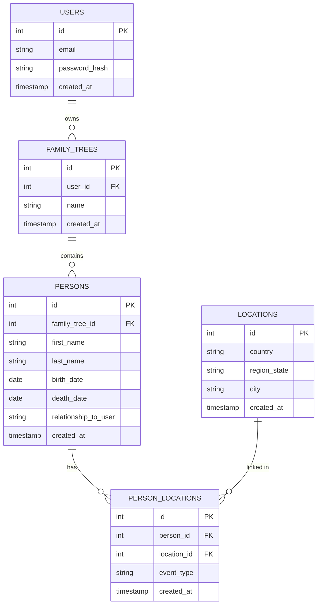

# 🌳 Family Tree Explorer — Initial Design

## **Purpose and Goals**
FamilySearch is great for *recording* family data, but not for *exploring* it.  
This project allows users to upload their FamilySearch GEDCOM file (or connect through the FamilySearch API) and then analyze their ancestry in new ways.

**Core Idea:** Help users *discover insights* and *interactively explore* their family tree.

### **Example Features**
- Identify the oldest well-documented ancestor from each country or region  
- Calculate an improved heritage composition estimate based on ancestral origins  
- Find ancestors with interesting life stories or unique occupations  
- Search for ancestors based on natural language prompts (e.g., “show me ancestors who immigrated to the U.S. in the 1800s”)  
- Integrate ChatGPT through an API to allow “chatting with your ancestry data”

I want to do this project because FamilySearch focuses on collecting history, not *exploring* it. I love family history, and I believe other family history enthusiasts would enjoy a new way to visualize and query their data.

---

### **Technology Stack**
- **Frontend:** React + TypeScript (tree visualization and query UI)  
- **Backend:** FastAPI (Python) REST API  
- **Database:** PostgreSQL for persistent data  
- **Caching:** Redis for frequent ancestry lookups  
- **External APIs:**  
  - FamilySearch API or local GEDCOM parser for data ingestion  
  - OpenAI API for ancestry “chat” and prompt-based exploration  
- **Deployment:** AWS EC2 or Lambda backend + S3 static frontend hosting + Route 53 DNS  

---

## **Data Model & Schema**

The database schema uses a simplified entity-relationship model with five main entities:

---

## **Planned Timeline and Goals**

| Week | Goals |
|------|--------|
| Week 1 | Research FamilySearch API & GEDCOM format. Design schema (ERD). Parse sample tree. |
| Week 2 | Build backend ingestion + basic queries (ancestors by location, oldest ancestor, etc.) |
| Week 3 | Create frontend tree visualization and data explorer UI. |
| Week 4 | Add filters (region, year, story search) + caching layer. |
| Week 5 | Integrate optional ChatGPT feature and record demo video. |

---

## **Additional Notes**
- **Reads/Writes:** Tree data is *written* to the database during import and *read* during queries and exploration.  
- **Concurrency:** Multiple users can upload and explore trees concurrently.  
- **Interesting Aspects:** Recursive data (relationships), hierarchical traversal, caching, and AI summarization make it a rich data-modeling project.  
- **Deliverables:** GitHub repo, `log.md`, ERD diagram, demo video, and final report.

---